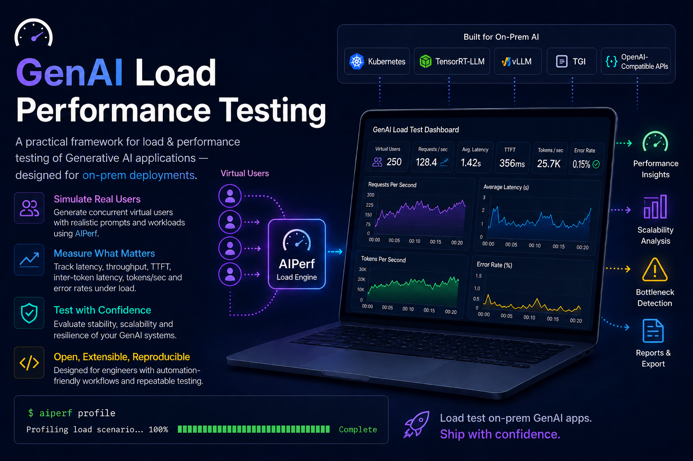
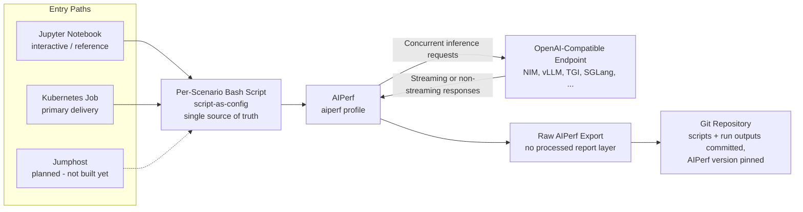

# GenAI Load & Performance Testing Suite



A reproducible LLM performance testing suite built on [NVIDIA AIPerf](https://github.com/ai-dynamo/aiperf). This tool is designed to help organizations (1) choose the right model for their specific use case and (2) determine the appropriate infrastructure sizing to support their load.

AIPerf is about endpoint benchmarking / workload generation / server metrics.

## Overview

The suite is backend-agnostic and supports any OpenAI-compatible endpoint, including NVIDIA NIM, vLLM, TGI, and others.

### Core Testing Suites

The repository is divided into two primary testing objectives:

#### 1. Model Selection (`model-selection/`)
Used to compare different models based on UX-relevant performance.
- **Focus**: Time to First Token (TTFT), Inter-Token Latency (ITL), and Goodput.
- **Methodology**: Runs a baseline concurrency and a shallow sweep (1, 5, 10, 25 concurrent users) to evaluate how different models handle typical user loads.

#### 2. Capacity & Sizing (`sizing/`)
Used to find the breaking point of a specific deployment to inform infrastructure scaling.
- **Focus**: Maximum sustainable goodput and latency degradation.
- **Methodology**: Runs the same 6 workload profiles against a fixed concurrency ladder (1, 5, 10, 25, 50, 100, 200) to identify where the system saturates.

## Key Concepts

### Script-as-Config
To ensure absolute reproducibility, this project uses a "script-as-config" approach. There is no separate YAML or JSON configuration schema; instead, **one bash script per scenario** serves as the single source of truth. Each script contains the `aiperf profile` invocation with all relevant flags and parameters.

### Reproducibility
- **Git-based Truth**: All scenario scripts and their corresponding raw output exports are committed to the repository.
- **Version Pinning**: The version of AIPerf used for each run is pinned to ensure consistent results across different environments.

## Getting Started

### Prerequisites
- NVIDIA AIPerf installed and configured in your environment.
- Access to an OpenAI-compatible LLM endpoint.

### Running Scenarios

Tests can be launched from a Kubernetes Job (primary delivery), interactively from the
notebooks, or from a jumphost (planned). All paths run the same per-scenario scripts —
see [docs/execution-flows.md](docs/execution-flows.md) for the detailed flow of each path.



To execute a performance test, run the corresponding bash script for the desired scenario:
```bash
./model-selection/scenario_name.sh
# OR
./sizing/scenario_name.sh
```

### Analyzing Results
The suite produces raw AIPerf exports. These files contain the detailed telemetry required to calculate the metrics defined in the documentation.

## Documentation

For detailed information on how scenarios are constructed and how to interpret the results, refer to the following guides:

- **Execution Flows**: [docs/execution-flows.md](docs/execution-flows.md) - How a test runs from each entry path (Kubernetes Job, notebooks, jumphost).
- **Scenario Definitions**: [docs/scenarios/](docs/scenarios/) - Detailed workload profiles, including input/output sequence lengths (ISL/OSL), turns, and think-time.
- **Metrics Guide**: [docs/metrics/](docs/metrics/) - Definitions of TTFT, ITL, Goodput, and other key performance indicators.
