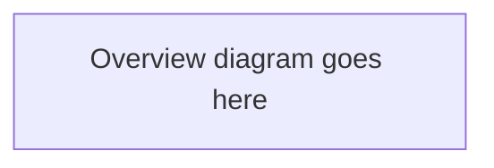
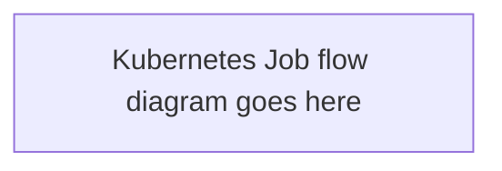
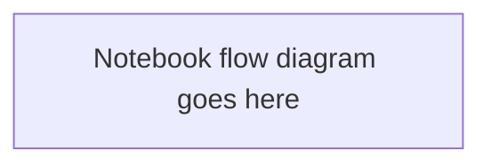
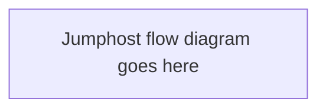

# Execution Flows

How a test actually runs, for each of the three entry paths. All paths converge on the
same per-scenario bash script (script-as-config), which issues the `aiperf profile`
invocation and produces the raw AIPerf export committed to Git.

<!-- TODO: paste mermaid diagrams into the placeholders below. -->

## Overview

End-to-end flow shared by all entry paths: entry point → per-scenario script → AIPerf →
target endpoint → raw export → committed to Git.

## In-Cluster (Kubernetes Job) — primary delivery

K8s Job manifests under `model-selection/k8s/` and `sizing/k8s/` (sizing runs one Job per
ladder rung with a shared PVC and an error-rate circuit breaker between rungs).

## Notebooks (interactive/reference)

`notebooks/model_selection_content_generation.ipynb` runs the Model Selection Content
Generation scenario end-to-end interactively. Reference material — not wired into either
suite's automation.

## Jumphost (planned — not built yet)

Native pip/binary install on a jumphost, no Docker. Calls the **same** per-scenario
scripts as the K8s path. Roadmap item; diagram describes the intended flow, not current
status.

